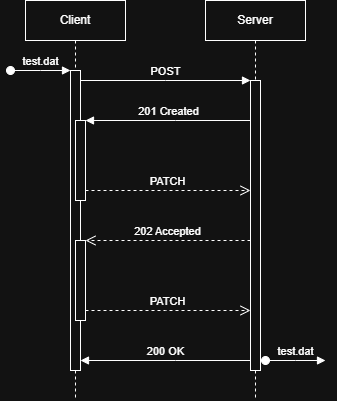

# Protocol

## Uploading

- Client sends `POST` to server with:
  - `checksum`: SHA256-hash of full file
  - `name`: Filename
  - `size`: Filesize
  - `type`: Mimetype
- Server responds `201 Created` with:
  - `uuid`: Unique ID for upload
  - `max_size`: Maximum size of chunk
  - `nonce`: Unique identifier per operation

- Client sends a chunk as `PATCH` to server with:
  - `uuid`: Upload ID
  - `chunk`: Binary data
  - `nonce`: Nonce given in previous operation
  - `checksum`: SHA256 of chunk sent (?)
- Server responds `202 Accepted` with:
  - `nonce`: Unique identifier per operation
  - `size`: Bytes received

- When all bytes are receivied server responds `200 OK`

## Cancel upload

- Client sends `DELETE` to server with:
  - `uuid`: Unique ID for upload
- Server responds `200 OK` (and deletes temporary files)

## Get current status

- Client sends `HEAD` to server with:
  - `uuid`: Unique ID for upload
  - `nonce`: Nonce given in previous operation
- Server responds `206 Partial Content` with:
  - `uuid`: Upload ID
  - `nonce`: Unique identifier per operation
  - `size`: Current upload size

## Errors

- Server cannot locate `uuid`: `404 Not Found`
- Invalid payload: `400 Bad Request`
- Verifying `nonce` fails: `400 Bad Request`
- Chunk upload failed: `415 Unsupported Media Type`
- Chunk is invalid: `422 Unprocessable Content`
- Chunk `checksum` does not match: `422 Unprocessable Content`
- File `checksum` does not match: `422 Unprocessable Content`
- Any other error: `500 Internal Server Error`